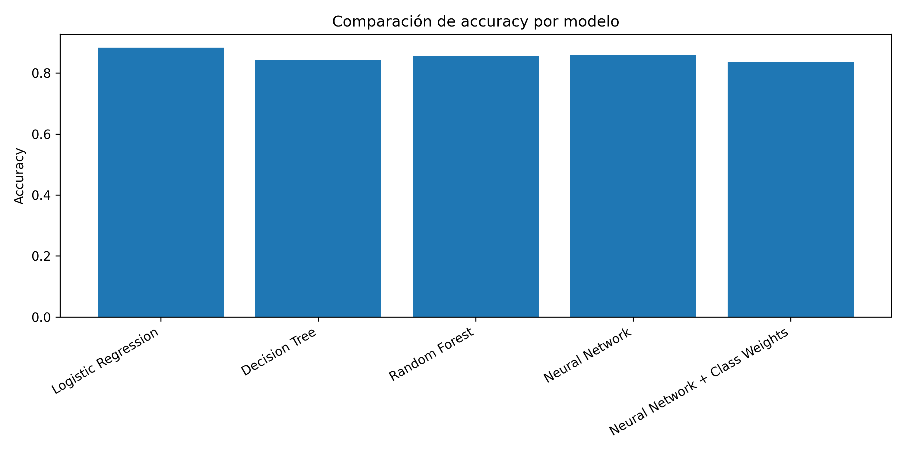
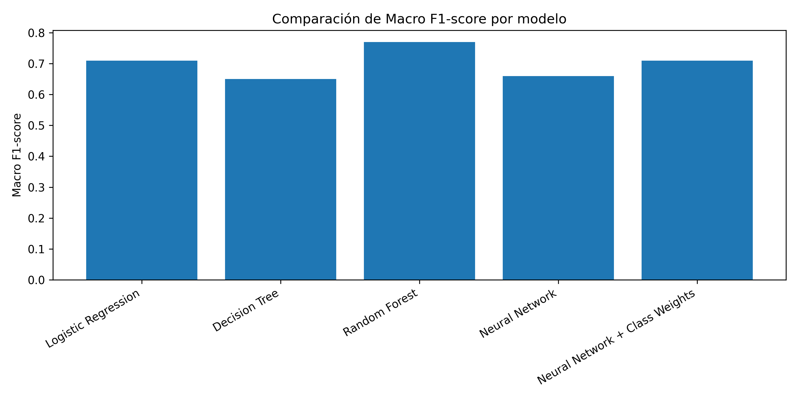
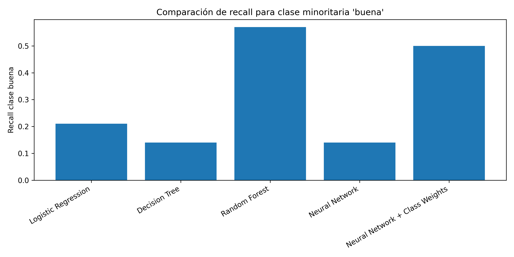
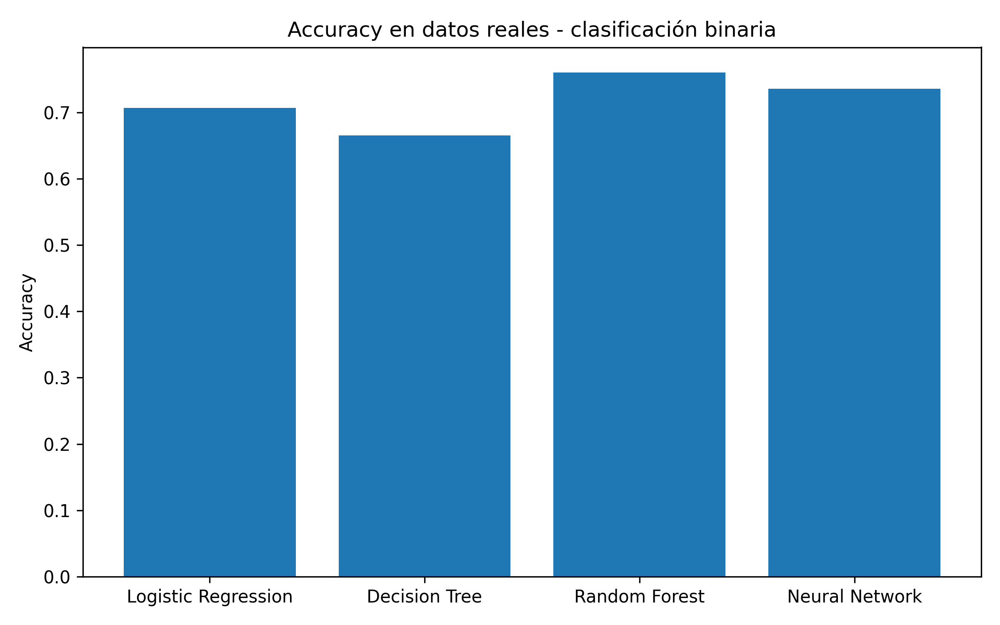
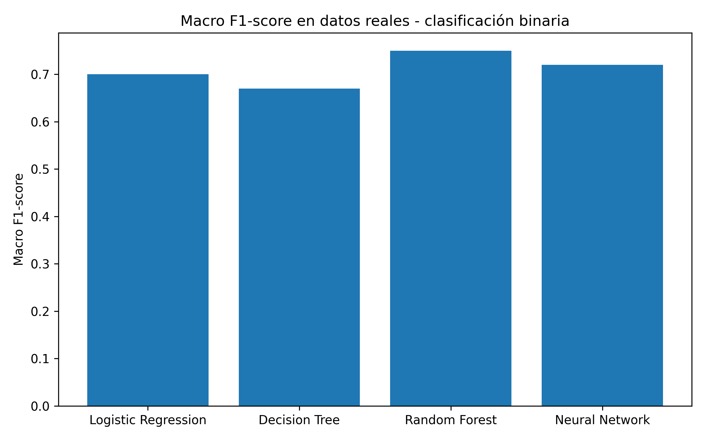
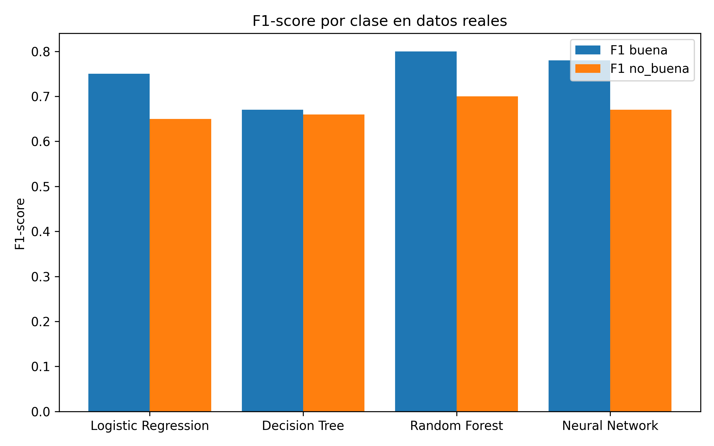
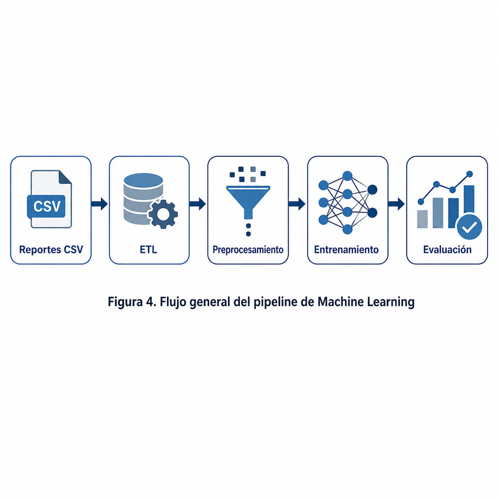

# Predicción de Calidad del Aire en Quito con Machine Learning

## Información del proyecto

**Proyecto:** Predicción de calidad del aire en Quito mediante modelos de Machine Learning  
**Curso:** Machine Learning / Statistical Learning  
**Dominio aplicado:** Medio ambiente y calidad del aire  
**Tipo de problema:** Clasificación supervisada  
**Ciudad de estudio:** Quito, Ecuador  
**Integrante:** Mateo Díaz  
**Versión de Python recomendada:** Python 3.12.x  

> Nota: se recomienda usar Python 3.12 porque TensorFlow no estaba disponible para Python 3.14 durante la instalación inicial del proyecto.

---

## 1. Descripción general

Este proyecto desarrolla un pipeline de Machine Learning para clasificar la calidad del aire en Quito usando datos horarios de contaminantes atmosféricos y variables meteorológicas.

El flujo general del proyecto incluye:

1. Obtención de reportes CSV reales.
2. Transformación ETL de reportes mensuales.
3. Preprocesamiento de datos.
4. Construcción de variables temporales.
5. Entrenamiento de modelos clásicos.
6. Entrenamiento de una red neuronal.
7. Evaluación y comparación de resultados.

El objetivo final es predecir si una observación horaria corresponde a una calidad de aire:

- `buena`
- `no_buena`

donde `no_buena` agrupa las clases `moderada` y `mala`.

---

## 2. Estructura del proyecto

```text
quito-air-quality-ml/
│
├── data/
│   ├── raw/
│   │   ├── quito_air_quality_sample.csv
│   │   ├── quito_air_quality_real.csv
│   │   └── real/
│   │       ├── MonthlyReport.csv
│   │       ├── MonthlyReport (1).csv
│   │       ├── MonthlyReport (2).csv
│   │       └── ...
│   │
│   └── processed/
│       ├── quito_air_quality_processed.csv
│       └── quito_air_quality_real_processed.csv
│
├── reports/
│   ├── model_comparison.csv
│   ├── real_binary_model_comparison.csv
│   ├── neural_network_model.keras
│   ├── real_binary_neural_network_model.keras
│   └── figures/
│       ├── accuracy_comparison.png
│       ├── macro_f1_comparison.png
│       ├── recall_buena_comparison.png
│       ├── real_binary_accuracy.png
│       ├── real_binary_macro_f1.png
│       ├── real_binary_f1_by_class.png
│       └── machine_learning_pipeline_flowchart.png
│
├── src/
│   ├── __init__.py
│   ├── config.py
│   ├── data_loader.py
│   ├── preprocessing.py
│   ├── features.py
│   ├── train.py
│   ├── models.py
│   └── evaluate.py
│
├── generate_sample_data.py
├── prepare_data.py
├── train_baseline.py
├── train_neural_network.py
├── build_real_dataset.py
├── prepare_real_data.py
├── train_real_baseline.py
├── train_real_binary.py
├── train_real_neural_network_binary.py
├── compare_models.py
├── compare_real_binary_models.py
├── requirements.txt
└── README.md
```

---

## 3. Requisitos del entorno

### 3.1 Crear entorno virtual

En Windows PowerShell, desde la carpeta raíz del proyecto:

```powershell
python -m venv .venv
```

Activar el entorno:

```powershell
.\.venv\Scripts\activate
```

### 3.2 Instalar dependencias

```powershell
pip install --upgrade pip
pip install pandas numpy matplotlib scikit-learn requests python-dotenv tensorflow jupyter
```

También se puede instalar desde `requirements.txt`:

```powershell
pip install -r requirements.txt
```

### 3.3 Verificar instalación

```powershell
python --version
pip freeze
```

Versiones usadas durante el desarrollo:

```text
pandas: 3.0.2
numpy: 2.4.4
scikit-learn: 1.8.0
tensorflow: 2.21.0
```

---

## 4. Datos utilizados

El proyecto utiliza dos tipos de datos:

1. **Datos sintéticos:** usados para validar el pipeline completo.
2. **Datos reales:** reportes horarios de calidad del aire de Quito descargados en formato CSV.

---

## 5. Fase 1: datos sintéticos

Primero se generó un dataset sintético de 1000 registros horarios para validar el flujo completo de Machine Learning.

Este dataset permitió probar:

- carga de datos;
- limpieza;
- creación de variables temporales;
- creación del target;
- entrenamiento de modelos baseline;
- entrenamiento de red neuronal;
- generación de gráficos.

### 5.1 Generar dataset sintético

```powershell
python generate_sample_data.py
```

Este comando genera:

```text
data/raw/quito_air_quality_sample.csv
```

### 5.2 Procesar datos sintéticos

```powershell
python prepare_data.py
```

Este comando genera:

```text
data/processed/quito_air_quality_processed.csv
```

### 5.3 Entrenar modelos baseline con datos sintéticos

```powershell
python train_baseline.py
```

Modelos entrenados:

- Logistic Regression
- Decision Tree
- Random Forest

### 5.4 Entrenar red neuronal con datos sintéticos

```powershell
python train_neural_network.py
```

También se evaluó una versión con pesos de clase para manejar desbalance.

### 5.5 Resultados preliminares con datos sintéticos

Se entrenaron cinco modelos de clasificación para predecir la categoría de calidad del aire:

- Logistic Regression
- Decision Tree
- Random Forest
- Neural Network
- Neural Network + Class Weights

Los resultados mostraron que Logistic Regression obtuvo el mayor accuracy general, mientras que Random Forest logró mejor equilibrio entre clases según Macro F1-score y recall de la clase minoritaria `buena`.

Estos resultados son preliminares porque se obtuvieron sobre un dataset sintético usado para validar el pipeline.

### 5.6 Gráficos sintéticos







---

## 6. Fase 2: construcción del dataset real de Quito

Los datos reales fueron descargados como reportes mensuales horarios de calidad del aire de Quito.

Los archivos originales estaban separados por variable ambiental y en formato ancho mensual. Por ejemplo:

```text
Day | 0 | 1 | 2 | ... | 23 | Max | Avg | RDS
```

Para convertirlos en un formato útil para Machine Learning se implementó un proceso ETL.

### 6.1 Proceso ETL

El script `build_real_dataset.py` realiza los siguientes pasos:

1. Lee cada reporte mensual CSV.
2. Extrae las mediciones horarias.
3. Convierte el formato ancho a formato largo.
4. Agrupa registros duplicados por fecha y hora.
5. Une todas las variables usando `datetime`.
6. Genera un dataset integrado.

### 6.2 Ubicación esperada de los CSV reales

Los archivos originales deben ubicarse en:

```text
data/raw/real/
```

Ejemplo:

```text
data/raw/real/MonthlyReport.csv
data/raw/real/MonthlyReport (1).csv
data/raw/real/MonthlyReport (2).csv
...
```

### 6.3 Generar dataset real integrado

```powershell
python build_real_dataset.py
```

Este comando genera:

```text
data/raw/quito_air_quality_real.csv
```

El dataset real generado contiene aproximadamente:

```text
816 registros horarios
12 columnas iniciales
```

Variables disponibles:

- PM2.5
- PM10
- NO2
- O3
- SO2
- CO
- temperatura
- humedad relativa
- precipitación
- velocidad del viento

---

## 7. Preprocesamiento del dataset real

Para procesar el dataset real:

```powershell
python prepare_real_data.py
```

Este comando genera:

```text
data/processed/quito_air_quality_real_processed.csv
```

El dataset real procesado contiene:

```text
805 registros horarios
17 columnas
```

Columnas principales:

- `datetime`
- `station`
- `pm25`
- `pm10`
- `no2`
- `o3`
- `so2`
- `co`
- `temperature`
- `humidity`
- `precipitation`
- `wind_speed`
- `hour`
- `dayofweek`
- `month`
- `is_weekend`
- `target`

---

## 8. Definición de la variable objetivo

Como el dataset real no incluye directamente una columna AQI, se definió una variable objetivo inicial usando PM2.5 como referencia:

| Categoría | Condición |
|---|---|
| `buena` | PM2.5 <= 15 |
| `moderada` | 15 < PM2.5 <= 35 |
| `mala` | PM2.5 > 35 |

La distribución multiclase fue:

| Clase | Registros |
|---|---:|
| buena | 490 |
| moderada | 299 |
| mala | 16 |

Esto muestra un desbalance fuerte, especialmente en la clase `mala`.

---

## 9. Prevención de fuga de información

Para evitar fuga de información, `pm25` no se usa como predictor en los modelos reales, ya que la variable objetivo fue construida a partir de PM2.5.

Los modelos reales usan como predictores:

- PM10
- NO2
- O3
- SO2
- CO
- temperatura
- humedad relativa
- precipitación
- velocidad del viento
- hora
- día de la semana
- mes
- indicador de fin de semana
- estación

---

## 10. Entrenamiento multiclase con datos reales

Se entrenaron tres modelos baseline sobre el dataset real procesado:

```powershell
python train_real_baseline.py
```

Modelos evaluados:

- Logistic Regression
- Decision Tree
- Random Forest

### 10.1 Resultados multiclase

| Modelo | Accuracy | Observación |
|---|---:|---|
| Logistic Regression | 0.5537 | Detectó algunos casos de clase `mala`, pero con muchos falsos positivos |
| Decision Tree | 0.5992 | No logró detectar casos de clase `mala` |
| Random Forest | 0.7438 | Obtuvo el mejor accuracy general, pero no detectó la clase `mala` |

### 10.2 Conclusión multiclase

Random Forest obtuvo el mejor desempeño general, con accuracy de 0.7438. Sin embargo, ningún modelo logró aprender correctamente la clase `mala`, debido a que solo existían 16 registros de esa categoría.

Por esta razón, se reformuló el problema como clasificación binaria.

---

## 11. Reformulación binaria del problema

Debido al fuerte desbalance en la clase `mala`, se reformuló el problema como:

- `buena`
- `no_buena`: combinación de `moderada` y `mala`

Distribución binaria:

| Clase | Registros |
|---|---:|
| buena | 490 |
| no_buena | 315 |

Esta formulación es más estable para el tamaño actual del dataset.

---

## 12. Entrenamiento binario con datos reales

Para entrenar los modelos clásicos binarios:

```powershell
python train_real_binary.py
```

Modelos evaluados:

- Logistic Regression
- Decision Tree
- Random Forest

### 12.1 Resultados binarios con modelos clásicos

| Modelo | Accuracy | F1 buena | F1 no_buena | Macro F1 |
|---|---:|---:|---:|---:|
| Logistic Regression | 0.7066 | 0.75 | 0.65 | 0.70 |
| Decision Tree | 0.6653 | 0.67 | 0.66 | 0.67 |
| Random Forest | 0.7603 | 0.80 | 0.70 | 0.75 |

El mejor modelo clásico fue **Random Forest**, con:

```text
Accuracy: 0.7603
Macro F1-score: 0.75
```

### 12.2 Matriz de confusión de Random Forest

| | Predicho buena | Predicho no_buena |
|---|---:|---:|
| Real buena | 116 | 31 |
| Real no_buena | 27 | 68 |

---

## 13. Red neuronal binaria

También se entrenó una red neuronal densa para la clasificación binaria:

```powershell
python train_real_neural_network_binary.py
```

### 13.1 Arquitectura

La arquitectura utilizada fue:

- Capa densa de 64 neuronas con activación ReLU
- Dropout de 0.2
- Capa densa de 32 neuronas con activación ReLU
- Dropout de 0.2
- Capa de salida con una neurona y activación sigmoid

La red fue entrenada con:

- `binary_crossentropy`
- optimizador Adam
- early stopping
- pesos de clase para compensar el desbalance

### 13.2 Resultado de red neuronal

| Modelo | Accuracy | F1 buena | F1 no_buena | Macro F1 |
|---|---:|---:|---:|---:|
| Neural Network | 0.7355 | 0.78 | 0.67 | 0.72 |

### 13.3 Matriz de confusión de la red neuronal

| | Predicho buena | Predicho no_buena |
|---|---:|---:|
| Real buena | 114 | 33 |
| Real no_buena | 31 | 64 |

La red neuronal logró un desempeño competitivo, pero no superó a Random Forest.

---

## 14. Comparación final de modelos reales binarios

Para generar el archivo CSV y las figuras finales:

```powershell
python compare_real_binary_models.py
```

Este script genera:

```text
reports/real_binary_model_comparison.csv
reports/figures/real_binary_accuracy.png
reports/figures/real_binary_macro_f1.png
reports/figures/real_binary_f1_by_class.png
```

### 14.1 Resultados finales

| Modelo | Accuracy | F1 buena | F1 no_buena | Macro F1 |
|---|---:|---:|---:|---:|
| Logistic Regression | 0.7066 | 0.75 | 0.65 | 0.70 |
| Decision Tree | 0.6653 | 0.67 | 0.66 | 0.67 |
| Random Forest | 0.7603 | 0.80 | 0.70 | 0.75 |
| Neural Network | 0.7355 | 0.78 | 0.67 | 0.72 |

### 14.2 Modelo final seleccionado

El modelo final recomendado es **Random Forest**, ya que obtuvo el mejor desempeño en datos reales binarios:

- Accuracy: 0.7603
- F1 buena: 0.80
- F1 no_buena: 0.70
- Macro F1: 0.75

Aunque la red neuronal logró resultados competitivos, Random Forest presentó mejor balance entre clases y mayor capacidad predictiva con el tamaño actual del dataset.

---

## 15. Figuras finales

### Accuracy



### Macro F1-score



### F1-score por clase



### Pipeline general



---

## 16. Cómo ejecutar el proyecto completo

### 16.1 Activar entorno virtual

```powershell
.\.venv\Scripts\activate
```

### 16.2 Generar datos sintéticos

```powershell
python generate_sample_data.py
python prepare_data.py
python train_baseline.py
python train_neural_network.py
python compare_models.py
python plot_model_comparison.py
```

### 16.3 Construir dataset real

Colocar los reportes CSV originales en:

```text
data/raw/real/
```

Luego ejecutar:

```powershell
python build_real_dataset.py
python prepare_real_data.py
```

### 16.4 Entrenar modelos con datos reales

```powershell
python train_real_baseline.py
python train_real_binary.py
python train_real_neural_network_binary.py
python compare_real_binary_models.py
```

---

## 17. Comandos principales

| Objetivo | Comando |
|---|---|
| Generar dataset sintético | `python generate_sample_data.py` |
| Procesar dataset sintético | `python prepare_data.py` |
| Entrenar modelos baseline sintéticos | `python train_baseline.py` |
| Entrenar red neuronal sintética | `python train_neural_network.py` |
| Construir dataset real | `python build_real_dataset.py` |
| Procesar dataset real | `python prepare_real_data.py` |
| Entrenar modelos reales multiclase | `python train_real_baseline.py` |
| Entrenar modelos reales binarios | `python train_real_binary.py` |
| Entrenar red neuronal real binaria | `python train_real_neural_network_binary.py` |
| Comparar modelos finales | `python compare_real_binary_models.py` |

---

## 18. Conclusiones

El proyecto demuestra que es posible construir un pipeline completo de Machine Learning para clasificar la calidad del aire de Quito usando datos reales.

Las principales conclusiones son:

1. Los datos reales requieren un proceso ETL antes de poder ser usados en Machine Learning.
2. La clasificación multiclase presentó problemas debido al fuerte desbalance de la clase `mala`.
3. La clasificación binaria `buena` vs `no_buena` fue más estable.
4. Random Forest fue el mejor modelo final.
5. La red neuronal obtuvo resultados competitivos, pero no superó a Random Forest.
6. Para datasets tabulares y de tamaño moderado, los modelos basados en árboles pueden ser más adecuados que una red neuronal densa.

---

## 19. Limitaciones

- El dataset real corresponde a un período limitado.
- La clase `mala` tiene muy pocos registros.
- La variable objetivo fue definida usando umbrales simplificados de PM2.5.
- Se utilizó una separación aleatoria train/test, no una validación temporal.
- No se realizó ajuste exhaustivo de hiperparámetros.

---

## 20. Trabajo futuro

Como mejoras futuras se propone:

- Incorporar más meses de datos reales.
- Evaluar validación temporal.
- Ajustar hiperparámetros de Random Forest.
- Probar técnicas de balanceo como oversampling o SMOTE.
- Agregar explicabilidad del modelo usando importancia de variables.
- Evaluar modelos adicionales como Gradient Boosting, XGBoost o SVM.
- Construir una interfaz simple para consultar predicciones.

---

## 21. Referencias

- G. James, D. Witten, T. Hastie, R. Tibshirani y J. Taylor, *An Introduction to Statistical Learning: With Applications in Python*. Springer, 2023.
- T. Hastie, R. Tibshirani y J. Friedman, *The Elements of Statistical Learning: Data Mining, Inference, and Prediction*. Springer, 2009.
- D. Morales, *Statistical Learning Lectures*, Universidad San Francisco de Quito, 2026.
- Documentación oficial de scikit-learn: https://scikit-learn.org/
- Documentación oficial de TensorFlow: https://www.tensorflow.org/
- Secretaría de Ambiente / Red Metropolitana de Monitoreo Atmosférico de Quito, reportes mensuales de calidad del aire.
